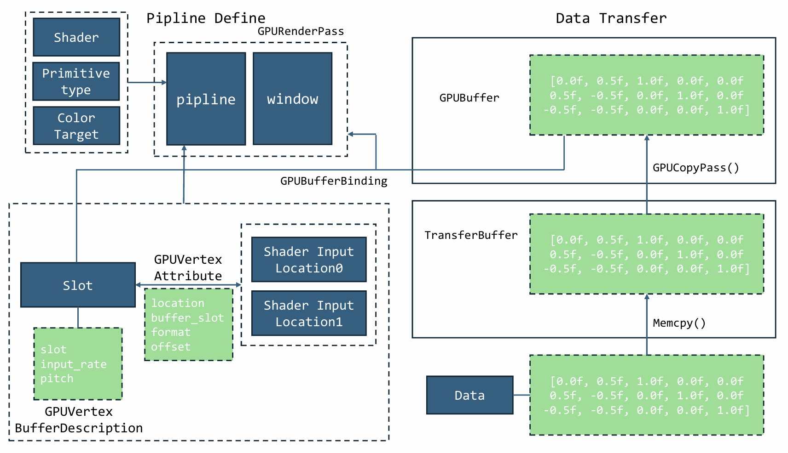

# SDL3

## 坐标系统

屏幕坐标采用`Direct`同款, 即`left-up`为原点。
屏幕坐标大小为`height * width`，而非0-1。

## SDL3的两套渲染管线

```c
Surface 管线（CPU渲染）:
   Surface (RAM)
      ↓  SDL_UpdateWindowSurface
   Window (显示内容)

Renderer 管线（GPU渲染）:
   Texture (VRAM)
      ↓  SDL_RenderCopy
   Back Buffer (VRAM)
      ↓  SDL_RenderPresent
   Window (显示内容)
```

|函数|作用|
|:-:|:-:|
|`SDL_UpdateWindowSurface`|把CPU内存中的surface像素拷贝到窗口显示|
|`SDL_RenderPresent`|把GPU后台缓冲区显示到窗口|

> 前者是“CPU 贴图”，后者是“GPU 翻屏”

所以，后续基本使用`Render`系统，而至于SDL1时代的遗老`Surface`则基本不使用。虽然至今依然需要使用`Surface`实现加载资源转移到GPU。

每一个`window`都有一个前缓冲区和后缓冲区，而`Render`操作的是后缓冲区，且一个`Render`和一个缓冲区或者说`window`是绑定的。

> 一改往期的拖沓，由于SDL3早已有了自己的wiki，且其`include`文件注释完整，故不再将大量时间耗费在感动自己的参数、功能笔记上。

## 一些常用函数

- `SDL_CreateWindowAndRenderer` 同时创建窗口和对应的`Render`。
- `SDL_Delay` SDL版本的sleep，且**仅仅阻塞当前线程**。
- `SDL_GetTicks` 获取时刻（1e-3），以Uint64形式返回。
- `SDL_GetTicksNS` 获取时刻（1e-9），以Uint64形式返回。
- `SDL_Log` Log输出，接收一个`const char*`。
- `SDL_GetError` 获取最新的错误（不是队列也不是堆栈，近唯一空间）。
- `SDL_zero` 将某个对象对应空间置为全0，用于规避不同系统对于初始化的不同填充方式。
- `SDL_SetRenderVSync` 将某`Render`设置为垂直同步，与显示器刷新率保持一致

## SDL3简单加载卸载

- `SDL_Init` 系统初始化
- `SDL_CreateWindow` 与SDL2不同，SDL3不再需要繁杂的初始化参数，名称，大小和功能标识就够了
- `SDL_CreateRenderer` 获取`Window`对应的`Render`。
- `SDL_PollEvent` 获取事件（使用时事件会先被底层系统处理）
- `SDL_SetRenderDrawColor` 设置清空所用颜色
- `SDL_RenderClear` 清空缓冲
- `SDL_RenderPresent` 交换缓冲
- `SDL_DestroyRenderer`
- `SDL_DestroyWindow`
- `SDL_Quit`

## 复杂图片加载

- `IMG_Load` 以`Surface`形式加载图片
- `SDL_CreateTextureFromSurface` 转化为`Texture`格式
- `SDL_DestroySurface`
- `SDL_RenderTexture` 以`Texture`填充
- `SDL_DestroyTexture`

## Texture操作

- `SDL_SetSurfaceColorKey` 设置颜色精灵（是对Surface进行操作）
- `SDL_RenderTextureRotated` 以旋转结果绘制在缓冲区，不是返回新的 `Texture`，先旋转再翻转，角度制
- `SDL_SetTextureColorMod` 混色方式为`srcC = srcC * (color / 255)` 
- `SDL_SetTextureAlphaMod` 更改`Alpha`值
- `SDL_SetTextureBlendMode` 设置混色方案（当前`Texture`被绘制在缓冲区时起作用）

## Font操作

- `TTF_Init`
- `TTF_OpenFont`
- `TTF_RenderText_Blended` 注意这里得到的`Surface`需要转化为`Texture`
- `TTF_CloseFont`
- `TTF_Quit`

## 按键状态

- `SDL_GetMouseState` 捕获鼠标坐标
- `SDL_GetModState` 获取`ctrl` `alt`等特殊按键的状态

> 其他的操作通过`SDL_PullEvent`获取

## 文字输入

- `SDL_StartTextInput` 开启指定`Window`的文字输入功能
- `SDL_SetClipboardText` 将字符串加入粘贴板
- `SDL_GetClipboardText` 从粘贴板读取字符串
- `SDL_StopTextInput` 终止指定`Window`的文字输入功能

---

从此开始，开始使用SDL3的新GPU渲染功能。

## 一些约定


### 立即销毁和延迟释放

- `XXX-Destroy--XXX`立即释放。
- `XXX-Release-XXX`延迟释放（当无引用计数后才真正释放）
- `SDL_DestroyGPUDevice` 延迟释放，且为阻塞同步点，会等待所有`GPU`相关动作结束。

### 关于GPU

- `GPU`是一个状态机。这意味着一旦你设定了一个状态，它就会一直保持，直到你再次修改它。
- 一切操作基于起始地址和数据长度，没有“结构”一说，所以哪怕传入数据非数组也要指出长度为1。

### 关于缓冲区

`Vulkan`显式的提供了三片存储区
- `User Host Memory` CPU私有内存（Zone1）
- `Staging` 暂存/中转（Zone2）
- `Device Local Memory` GPU私有内存（Zone3）

**数据传输方式**

- `Zone1` --> `Zone2`
	CPU指令(Load/Store) + MMU(内存管理单元) + 缓存一致性协议，CPU一直在干活
- `Zone2` --> `Zone3`
	PCIe总线，DMA方式

## 文件读取

- `SDL_IOFromFile` 打开文件
- `SDL_GetIOSize` 获取流大小
- `SDL_ReadIO` 流读取
- `SDL_CloseIO` 关闭文件

以下为示例

```cpp
std::vector<Uint8> loadFile(const char* path) {
	SDL_IOStream* f = SDL_IOFromFile(path, "rb");
	if (!f) {
		SDL_Log("Failed to open %s", path);
		return {};
	}

	Sint64 size = SDL_GetIOSize(f);
	std::vector<Uint8> data(size);
	SDL_ReadIO(f, data.data(), size);
	SDL_CloseIO(f);
	return data;
}
```

### HLSL约定

顶点着色器输入

|语义|意义|说明|
|:-:|:-:|:-:|
|`SV_VertexID`|顶点索引（从Draw Call产生）|不依赖实际顶点数据，可以用于 procedural geometry|
|`SV_InstanceID`|实例索引|实例化渲染使用|
|`SV_VertexIndex`|与SV_VertexID类似|现代API中与VertexID等价|
|`SV_IsFrontFace`|面朝向（正面/背面）|用于几何相关计算，VS中通常不使用（GS/PS常用）|
|`SV_CullPrimitive`|用于可变着色模型的面剔除指示|DX12可用|

顶点着色器输出

|语义|意义|说明|
|:-:|:-:|:-:|
|`SV_Position`|变换后的裁剪空间位置 (clip-space position)|必须至少输出一个 SV_Position 给光栅化阶段|

像素着色器输入

|语义|意义|说明|
|:-:|:-:|:-:|
|`SV_Position`|像素中心的屏幕空间坐标 (float4)|光栅化自动产生|
|`SV_PrimitiveID`|图元ID|GS/PS都可使用|
|`SV_IsFrontFace`|当前像素属于正面或背面|用于双面着色|
|`SV_SampleIndex`|当前样本顶点|仅在多重采样中|
|`SV_Coverage`|像素覆盖率掩码|仅在MSAA模式|
|`SV_ClipDistanceX / SV_CullDistanceX`|裁剪距离|继承自VS输出|

像素着色器输出

|语义|意义|说明|
|:-:|:-:|:-:|
|`SV_Target / SV_Target0`|写入渲染目标（颜色缓冲区）|常用|
|`SV_Target1..N`|MRT 多渲染目标|写入多个 RT|
|`SV_Depth`|输出自定义深度值|替换硬件自动计算的深度|
|`SV_DepthLessEqual / SV_DepthGreaterEqual`|深度写入规则特殊化|DX11.3+|
|`SV_StencilRef`|写自定义模板值|DX11.3+|

> 只有输出（顶点）输入（像素）`SV_Position`是必须的

## 基本流程

- `SDL_CreateGPUDevice` 创建`GPU`上下文。
- `SDL_ClaimWindowForGPUDevice` 将上下文与窗口绑定。
- 使用 `glslangValidator` 将 `hlsl` 文件编译为 `spv` 文件。
	```bat
	glslangValidator -V --invert-y -o .\SDL\glsl\triangle.frag.spv -e main .\SDL\glsl\triangle.frag.hlsl
	```
	* `-V` 编译为`SPIR-V`
	* `--invert-y` 屏幕Y轴反转，符合`Yulkan`屏幕空间定义
	* `-e` 指定入口函数
- `SDL_GPUShaderCreateInfo` 创建初始`Shader`所用的信息
	* 必填字段：`format` `stage` `code` `code_size`
	```cpp
	info.format = SDL_GPU_SHADERFORMAT_SPIRV;
	info.stage = stage;
	info.code = data.data();
	info.code_size = data.size();
	```
- 创建`Shader`。
- 上传数据
- 绑定`slot`和`location`解释和对应关系
- 组件`pipline`
- 创建`pass`，明确`slot`和真实`buffer`对应关系，输出屏幕等信息
- 开始循环绘制

此流程由下图所示



## 槽位空间和数据

### 顶点输入槽位

没有类型之分，没有`space` `b` `t`等区分，上图的流程使用的就是顶点输入槽位。
在`HLSL`表现为没有`register`的主函数输入。

### 像素输入槽位

来自上一阶段`GPU`数据，无法通过`CPU`控制和外部数据传入。
在`HLSL`表现为没有`register`的主函数输入。

### 资源槽位

|名称|描述|
|:-:|:-:|
|`space`|命名空间，描述表指针|
|`t[n]`|表示着色器资源视图 (SRV)|
|`s[n]`|表示采样器|
|`u[n]`|表示无序访问视图 (UAV)|
|`b[n]`|表示常量缓冲区视图 (CBV)|

> `t` `s` `u` `b` 槽位相互独立，互不干扰。

### HLSL转SPIR-V

- `space`被转为`Descriptor Set`
- `tsub`被转为`Binding`**相同编号会转为同一个`Binding`**。

> `tsub`在物理硬件根本不存在，这些都是`HLSL`用来标记不同类型数据的标识符，方便其操作数据时能使用与数据最匹配的操作函数，以加速或优化操作。

> `SPIR-V`不仅仅是记录了`binding`编号，它还通过类型系统和 操作指令完美地继承了`HLSL`的意图。

```hlsl
struct Input {
    float3 pos : POSITION;   // 编译器通常自动分配为 Location 0
    float2 uv  : TEXCOORD0;  // 编译器通常自动分配为 Location 1
};
```